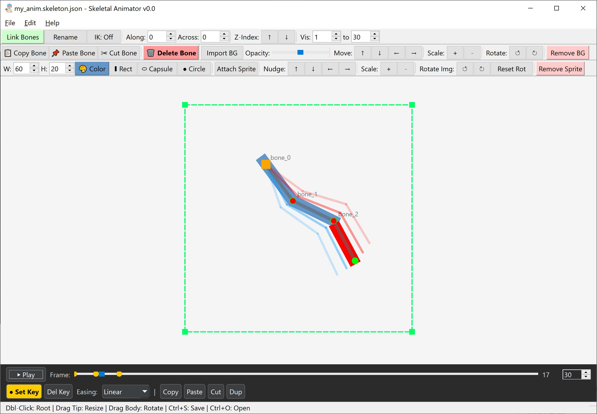

# 🦴 Skeletal Animator (v0.0)

A professional, offline 2D cutout animation tool for animators and game developers. Build skeletons, attach sprites, and bring your characters to life using an intuitive timeline and inverse kinematics. 

This is the **v0.0 release** of the Skeletal Animator.

---
<table>
<tr>
<td>Figure 1. A snapshot of the Skeletal Animator, version 0.0
</td>
</tr>
</table>

---

## 📥 Download the App (Windows)

The main application is provided as a standalone Windows executable. You don't need Python installed to use it!

**[⬇️ Download skeletal_animator.exe](https://drive.google.com/file/d/1vNWXwKJO2ntFVMG5XO_o517zo4Sk6VGG/view?usp=sharing)**

1. Download the `.exe` file.
2. Double-click to run.
3. Start animating immediately!

---

## ✨ Features

- **Rigging & IK:** Create bone chains, parent them with attachment offsets, and use Inverse Kinematics to automatically bend limbs naturally.
- **Skinning:** Import PNG sprites or generate primitive shapes (Rectangle, Capsule, Circle) with custom colors and non-uniform scaling.
- **Animation Studio:** A professional timeline with Keyframes, Easing (Linear, Ease In, Out, In-Out), and Onion Skinning (adjustable past/future ghosts).
- **Camera & Visibility:** Keyframe a camera viewport (Clip Window) to pan and zoom across your animation. Set visibility ranges so bones only appear on specific frames.
- **Workflow:** Z-Index for draw order, bone naming, copy/paste/cut for both bones and keyframes, and full Undo/Redo history.
- **Export:**
  - **Spritesheet:** Export a PNG grid + metadata JSON for your game engine.
  - **Video:** Export as MP4, WebM, MOV, or GIF. Supports transparent backgrounds for game engines!

---

## 💻 For Developers: Python Demo

To use the exported spritesheets in your own Python games, a demo script is provided in this repository.

### `demo_spritesheet.py`
A fully runnable Pygame demo that automatically reads the exported metadata JSON and plays the spritesheet animation smoothly.
* **To run:** 
  1. `pip install pygame`
  2. Export a track as `animation.png` and `animation.json` from the main app.
  3. Run `python demo_spritesheet.py`.
* **Controls:** `ESC` to Exit.

---

🌟 Support

If Skeletal Animator helps you bring your characters to life, please consider supporting us by giving this repository a ⭐ on GitHub! It helps other animators and developers discover the tool and fuels our future updates (and our virtual chai ☕)

---

## ❤️ Credits

Developed by Hamed Shah-Hosseini, under the V star (with lots of virtual chai). ☕

Built with Math, and a passion for animation and game development.

---
